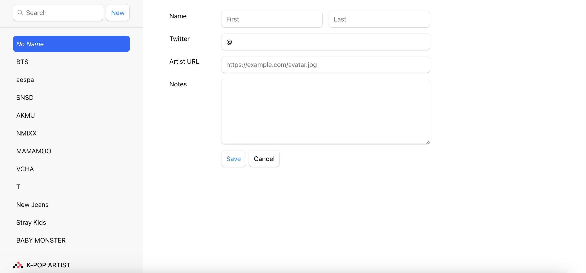
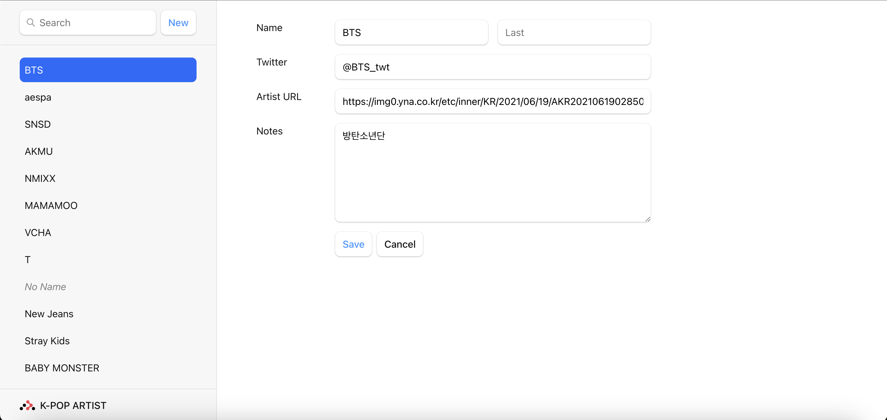
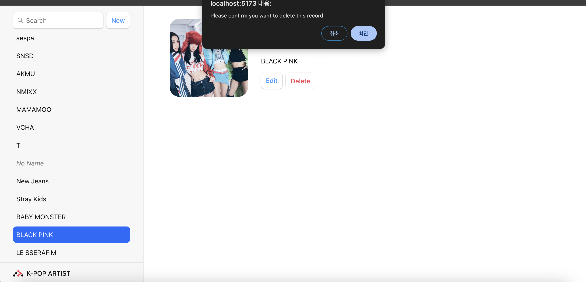

# React + Vite 활용한 K-POP 아티스트

**K-Pop 아티스트 콘셉트로 Create(생성) Read(읽기) Update(갱신) Delete(삭제) 기본 데이터 처리 기능을 접목한 웹 애플리케이션 서버(WAS)**

### ✅ 개발 환경 설정
```bash
$ npm create vite@latest name of project -- --template react
$ cd project directory
$ npm install react-router-dom
$ npm install localforage match-sorter sort-by
```

### ✅ 실행
```bash
$ npm run dev
```

### ✅ 브라우저 실행
```
http://localhost:5173
```

<div style="center; text-align: center">

<p>Main</p>
</div>


## CRUD 기능

<div style="float: left; width: 50%; text-align: center;">
    
    <p>Create(생성)</p>
</div>

<div style="float: right; width: 50%; text-align: center;">
    
    <p>Read(조회)</p>
</div>

<div style="float: left; width: 50%; text-align: center;">
    
    <p>Update(수정)</p>
</div>

<div style="float: right; width: 50%; text-align: center;">
    
    <p>Delete(삭제)</p>
</div>

<div style="clear: both;"></div>
